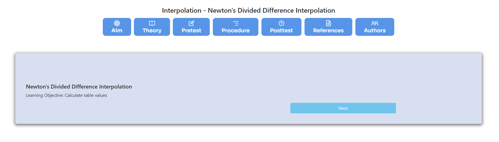
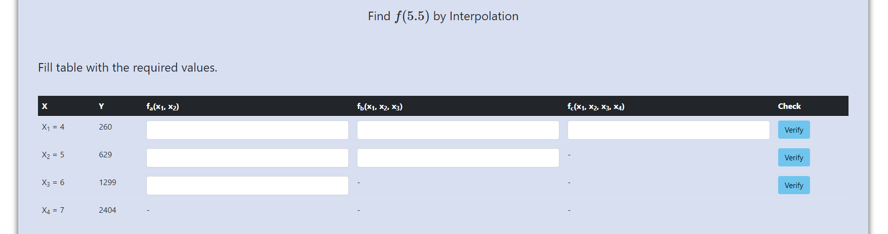
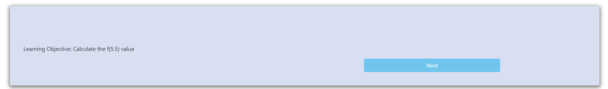
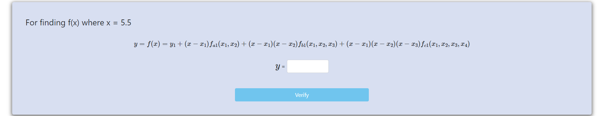
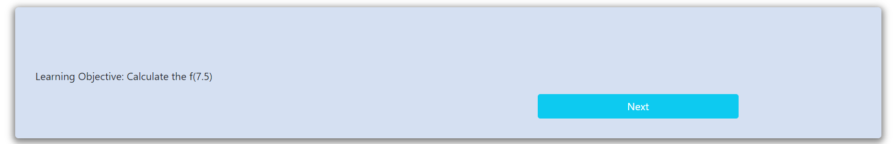
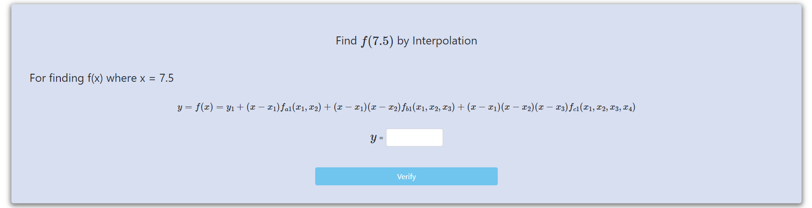

<h3><b>Step 1:</b> Click on "Next" </h3>

 

<h3><b>Step 2:</b> Fill the table </h3>

<h3>Then click on "Verify" buttons</h3>

 

<h3><b>Step 3:</b> Click on "Next" </h3>

 

<h3><b>Step 4:</b> Calculate y </h3>

<h3>Then click on "Verify"</h3>

 

<h3><b>Step 5:</b> Click on "Next" </h3>

 

<h3><b>Step 6:</b> Calculate y </h3>

<h3>Then click on "Verify", experiment completed.</h3>